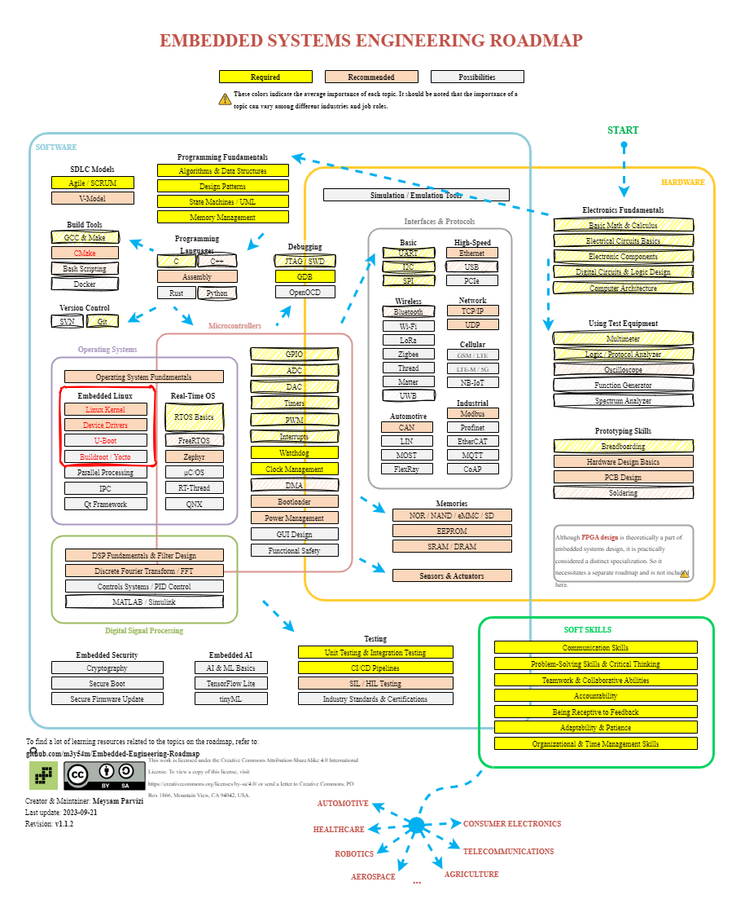

# Hi 👋, I'm Leo

A passionate firmware/embedded/full-stack developer from Taiwan

## 🚀 Languages and Tools I Use

- Programming Languages

- Frontend Development

- Backend Development

- Database

- Devops

- Framework

- Software

- Static Site Generators

- Other

## 🚩 Gist

<!-- GISTS_START -->

- [ubuntu-system-management.md](https://gist.github.com/leoli0605/80f6a78b57dfbe431616edf89f4cc28d)
- [github_alerts.md](https://gist.github.com/leoli0605/3dfad8f972656044b428ee657b8f155e)
- [waveshare_fan_hat_setup.sh](https://gist.github.com/leoli0605/3fdf977e7211bab6447b216d70f901d4)
- [intl.js](https://gist.github.com/leoli0605/44dbc658c5ded573054cd409102312c8)
<!-- GISTS_END -->

## 🚩 Projects I've contributed to

| Project                                                                               | -                                                                                                                                                                               |     -      |
| ------------------------------------------------------------------------------------- | ------------------------------------------------------------------------------------------------------------------------------------------------------------------------------- | :--------: |
| [docker-hugo](https://github.com/leoli0605/docker-hugo)                               |                               |            |
| [docker-arm-none-eabi-gcc](https://github.com/leoli0605/docker-arm-none-eabi-gcc)     |     |            |
| [pywidgets-ext](https://github.com/leoli0605/pywidgets-ext)                           |                                                                        |    EOL     |
| [vscode-bettergpt-extension](https://github.com/leoli0605/vscode-bettergpt-extension) |  | Deprecated |
| [npm-git-setup](https://github.com/leoli0605/npm-git-setup)                           |                                                                  |            |
| [npm-env-setup](https://github.com/DinosauriaLab/npm-env-setup)                       |                         |            |

## ⚡️ Where to find me

## 🗺️ Embedded Engineer Roadmap

## 🔗 Related Links

- [Embedded-Engineering-Roadmap](https://github.com/m3y54m/Embedded-Engineering-Roadmap)
- [Full-Stack-Roadmap](https://roadmap.sh/full-stack)
- [Github Profile Generator](https://github.com/wuyasong/github-profile-generator)

## ❤️ Support Me

Feel free to explore my repositories and don't hesitate to reach out if you have any questions or collaboration ideas. Happy coding!
